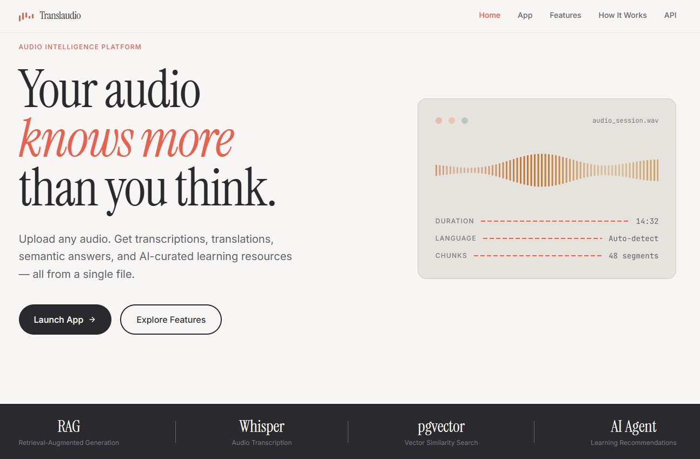
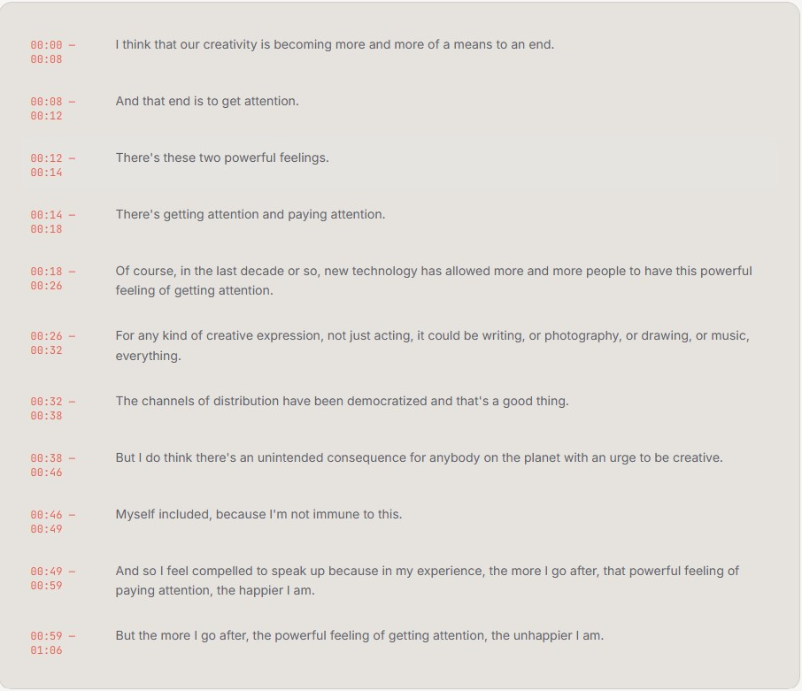
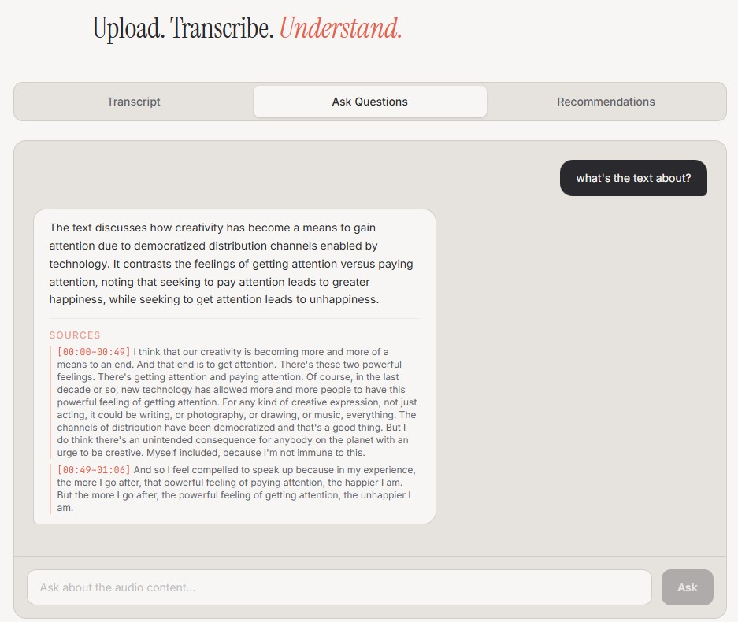
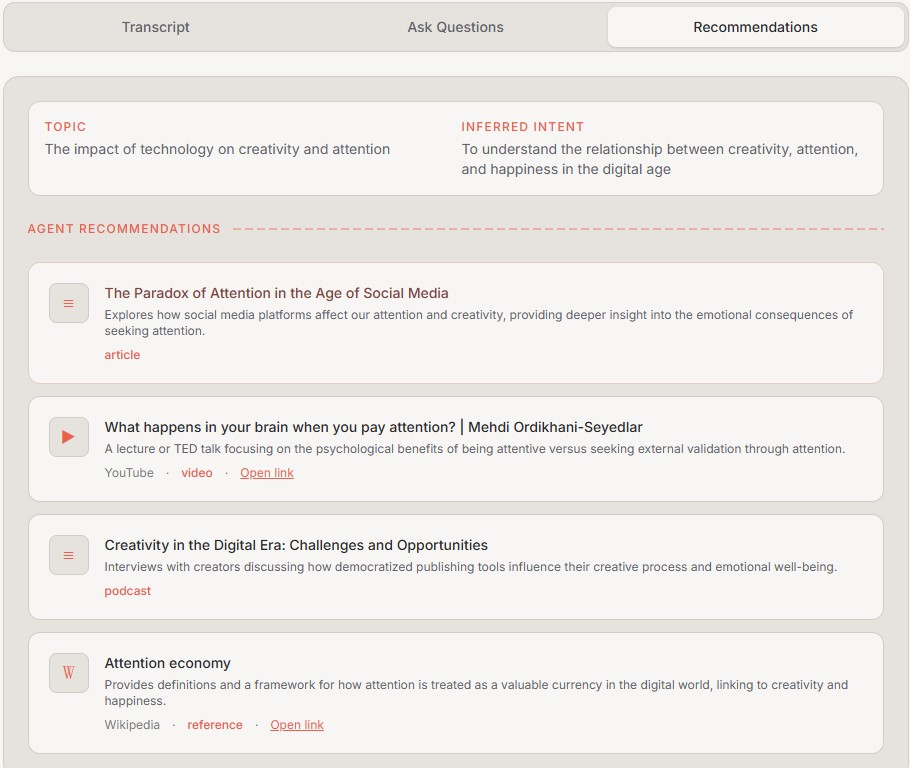

<div align="center">

#  Translaudio

### Your audio knows more than you think.
</div>

An AI-powered audio intelligence platform that transforms raw audio into a searchable, interactive knowledge system using transcription, semantic retrieval (RAG) and an AI agent for learning recommendations.

<p align="center">
  
</p>

---

##  Overview

Translaudio is an audio intelligence system that lets users:

- Upload audio files in multiple formats
- Automatically transcribe and translate spoken content
- Ask questions about the content (RAG-based Q&A)
- Get AI-curated follow-up learning resources based on question intent

This project demonstrates a full **end-to-end AI pipeline**, combining:

- Speech-to-text (Whisper)
- Vector search (pgvector)
- Retrieval-Augmented Generation (RAG)
- AI Agent-based recommendations

---

##  Features

###  Audio Processing
- Supports multiple formats: `.mp3` `.wav` `.m4a` `.flac` `.aac` `.ogg` `.wma` `.opus` `.aiff` `.ape`
- Automatic transcription using Whisper
- Automatic language detection
- Optional translation to target language
- Timestamped transcript generation

---

###  RAG-based Q&A
- Ask natural language questions about your audio
- Retrieve relevant transcript chunks using vector similarity
- Generate grounded answers based only on transcript evidence

---

###  AI Agent Recommendations
- Understands your **question + answer + context**
- Infers topic and learning intent
- Recommends:
  - 📺 Videos 
  - 📚 Articles
  - 🎧 Podcasts
  - 📖 References 

---

### Additional Capabilities
- Vector embeddings for semantic search
- Summary generation
- Clean, modern UI with smooth animations

- **Transcription** — Whisper transcribes any audio format with automatic language detection
- **Translation** — Auto-translates to a target language via GPT when the source differs
- **Semantic Search** — pgvector-powered cosine similarity search over transcript chunks
- **RAG-based Q&A** — Ask questions and get answers grounded in actual transcript content, with timestamped source citations
- **AI Agent Recommendations** — Analyzes your question and the answer to recommend articles, YouTube videos, podcasts, and Wikipedia references
- **Summarization** — Concise summary of the full transcript
 
---

##  Architecture

```text
Upload Audio
   ↓
Whisper Transcription
   ↓
Chunking (timestamped segments)
   ↓
Embedding (OpenAI)
   ↓
PostgreSQL + pgvector
   ↓
Semantic Retrieval
   ↓
LLM Answer Generation (RAG)
   ↓
AI Agent → Learning Recommendations
```

##  Tech Stack

###  Frontend
- Astro  
- React (interactive components)  
- TailwindCSS  
- TypeScript  

###  Backend
- FastAPI  
- SQLAlchemy  
- OpenAI API  
- Whisper (local model)  

###  Database
- PostgreSQL  
- pgvector (vector similarity search)  

###  External APIs
- OpenAI (LLM + embeddings)  
- YouTube Data API  
- Wikipedia API

| Layer | Technology |
|---|---|
| Frontend | Astro, React, TypeScript, Tailwind CSS |
| Backend | FastAPI (Python) |
| Transcription | OpenAI Whisper (`base` model, local) |
| LLM | OpenAI GPT-4.1-mini |
| Embeddings | OpenAI `text-embedding-3-small` (1536 dims) |
| Vector DB | PostgreSQL + pgvector |
| ORM | SQLAlchemy |
| External APIs | YouTube Data API v3, Wikipedia API |
| Containerization | Docker, Docker Compose |

---

##  Project Structure

```
Translaudio/
├── frontend/
│   └── src/
│       ├── components/
│       │   ├── AppInterface.tsx       # Main app UI (upload, tabs, Q&A, recommendations)
│       │   ├── WaveformVisualizer.tsx # Animated canvas waveform
│       │   ├── ScrollReveal.tsx       # Intersection Observer scroll animations
│       │   └── MobileMenu.tsx         # Responsive hamburger nav
│       ├── layouts/
│       │   └── Layout.astro
│       └── pages/
│           ├── index.astro
│           ├── app.astro
│           ├── features.astro
│           ├── how-it-works.astro
│           ├── api.astro
│           └── about.astro
├── backend/
│   ├── server.py       # FastAPI app — all endpoints
│   ├── db.py           # SQLAlchemy engine & session
│   ├── models.py       # Session & TranscriptChunk ORM models
│   ├── init.sql        # Enables pgvector extension
│   └── Dockerfile      # PostgreSQL + pgvector image
└── docker-compose.yml
```

---

##  Installation

### 1. Clone the repository

```bash
git clone https://github.com/your-username/translaudio.git
cd translaudio
```

### 2. Environment variables

Create a `.env` file in the backend:

| Variable | Required | Description |
|---|---|---|
| `DATABASE_URL` | ✅ | PostgreSQL connection string |
| `OPENAI_API_KEY` | ✅ | OpenAI API key (Whisper + GPT + Embeddings) |
| `YOUTUBE_API_KEY` | ⬜ | YouTube Data API v3 key for video recommendations |
 

### 3. Run with Docker

```bash
docker-compose up --build
```

### 4. Run backend manually

```bash
cd backend
pip install -r requirements.txt
uvicorn server:app --reload
```

### 5. Run frontend

```bash
cd frontend
npm install
npm run dev
```

---

##  API Endpoints

| Method | Endpoint | Description |
|---|---|---|
| `POST` | `/upload` | Upload audio file — returns transcription, translation, session ID, and segments |
| `POST` | `/summarize` | Summarize a given text |
| `POST` | `/search` | Semantic search over transcript chunks by session |
| `POST` | `/ask` | RAG-based Q&A — returns answer + timestamped source chunks |
| `POST` | `/recommend-resources` | AI agent recommends articles, videos, podcasts, and references |
| `GET` | `/` | Health check |

### Upload Audio
```
POST /upload
```
- Upload audio file  
- Returns transcription, translation, session ID  

---

### Summarize
```
POST /summarize
```
- Input: text  
- Output: summary  

---

### Ask Questions (RAG)
```
POST /ask
```

```json
{
  "session_id": "...",
  "question": "What is the main idea?"
}
```

---

### Recommend Resources (Agent)
```
POST /recommend-resources
```

- Input: question + answer + sources  

Output:
- topic  
- intent  
- recommended resources  

---

##  How It Works

### 1. Transcription
Audio is processed using Whisper, generating text + timestamps.

### 2. Translate
If the source language differs from the target, GPT translates the full transcript

### 3. Chunking
Transcript is split into manageable semantic chunks.

### 4. Embedding
Each chunk is converted into a vector representation via `text-embedding-3-small` and stored in PostgreSQL with pgvector.

### 5. Retrieval
User queries are embedded and matched against stored vectors using cosine similarity.

### 6. Generation (RAG)
The LLM generates answers grounded in retrieved transcript chunks. Top-5 retrieved chunks are passed to GPT-4.1-mini as grounded context.

### 7. Recommend (AI Agent)

Analyzes:
- User question  
- Generated answer  
- Supporting context  

Then recommends relevant learning materials.

---

## Deployment

This project was deployed on AWS using an EC2 instance for application hosting and Amazon S3 for audio file storage.

### Architecture Overview

The system consists of three main parts:

- **Frontend**: Built locally and served as static files from `frontend/dist`
- **Backend**: FastAPI application running on an AWS EC2 instance
- **Storage**: Amazon S3 bucket used to store uploaded audio files

### Runtime Flow

1. A user uploads an audio file from the frontend.
2. The FastAPI backend receives the file.
3. The file is temporarily stored on the EC2 instance.
4. Audio processing is performed using `ffmpeg` and Whisper.
5. The uploaded file is sent to Amazon S3.
6. Metadata and transcript-related data are stored in PostgreSQL.
7. The temporary local file is removed from the server.

### AWS Services Used

- **EC2** for hosting the FastAPI server
- **S3** for persistent audio storage
- **IAM Role** attached to the EC2 instance to allow secure access to S3 without embedding AWS credentials in code

### Environment Variables

The backend expects the following environment variables:

```env
OPENAI_API_KEY=
DATABASE_URL=
S3_BUCKET_NAME=
S3_REGION=

---

## 📸 Screenshots

### ⬆️ Upload & Processing

<p align="center">
  
</p>

### 📝 Transcript View
<p align="center">
  
</p>

### 💬 Q&A
<p align="center">
  
</p>

### 🤖 Recommendations
<p align="center">
  
</p>

##  Author

Built by **Amit Messika**


